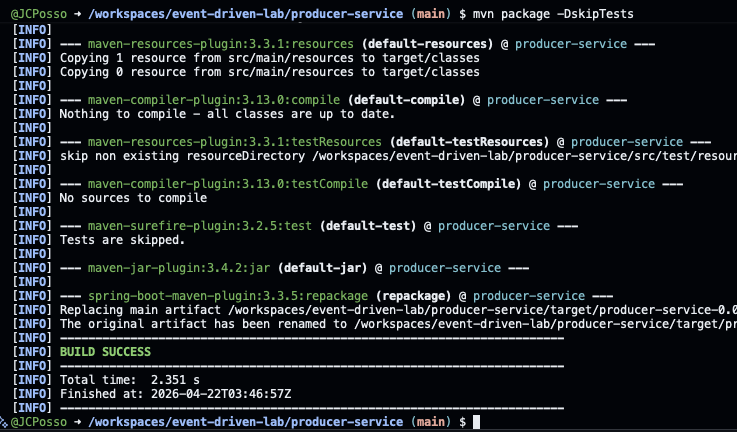
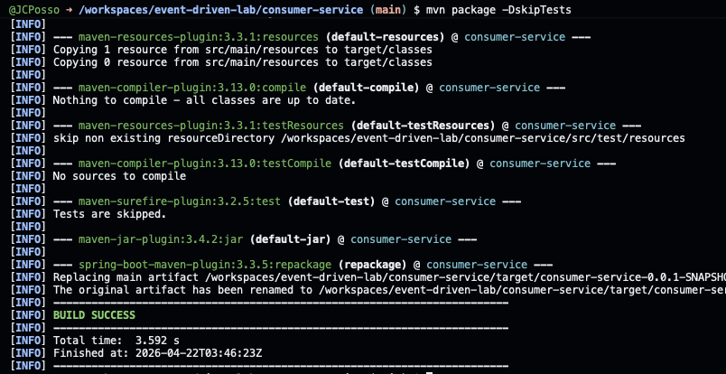
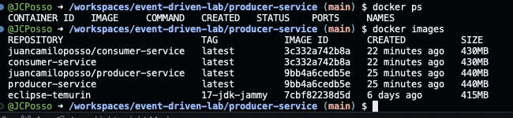
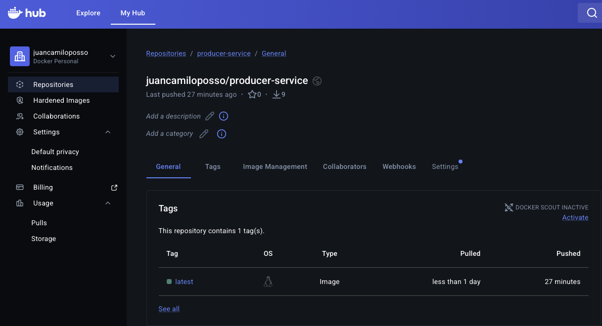
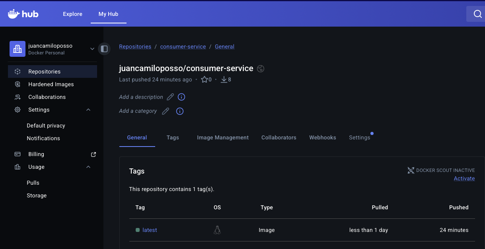
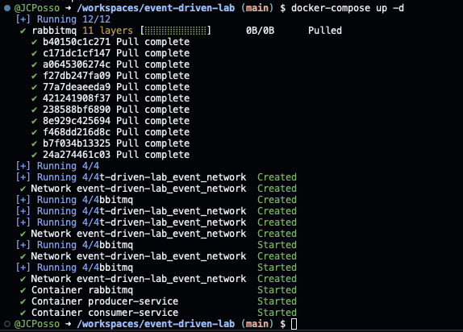
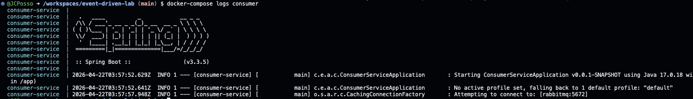
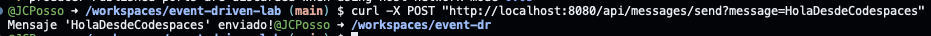
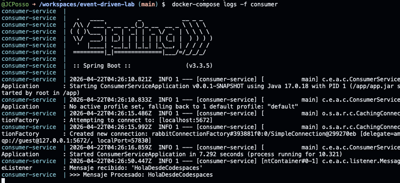

# Taller: Arquitectura Orientada a Eventos

En este taller se documenta una solución de microservicios con Spring Boot, RabbitMQ y Docker Compose. La meta es implementar un flujo simple de eventos donde un productor envía mensajes y un consumidor los procesa.

## Objetivo del taller

Implementar y ejecutar dos microservicios:

- Producer Service: expone un endpoint REST para publicar mensajes.
- Consumer Service: escucha una cola RabbitMQ y procesa los mensajes recibidos.

## Estructura del proyecto

```text
event-driven-lab/
|-- producer-service/
|-- consumer-service/
|-- .devcontainer/
|-- docker-compose.yml
`-- README.md
```

## Herramientas usadas

- Java 17
- Maven
- Spring Boot
- RabbitMQ
- Docker y Docker Compose
- GitHub Codespaces
- Docker Hub

## Paso 1. Configuración inicial en Codespaces

1. Se crea el repositorio en GitHub.
2. Se configura el entorno con .devcontainer.
3. Se abre el proyecto en Codespaces para trabajar el taller en la nube.

### Evidencia paso 1

- [ ] Creación del Codespace
- [ ] Proyecto abierto en Codespaces


## Paso 2. Implementación del Producer Service

En este servicio se configura Spring AMQP y se expone un endpoint para enviar mensajes al exchange de RabbitMQ.

Configuración principal:

```properties
server.port=8080
spring.rabbitmq.host=rabbitmq
spring.rabbitmq.port=5672
spring.rabbitmq.username=guest
spring.rabbitmq.password=guest
app.rabbitmq.exchange=messages.exchange
app.rabbitmq.queue=messages.queue
app.rabbitmq.routingkey=messages.routingkey
```

### Evidencia paso 2

- [ ] Compilación del producer



## Paso 3. Implementación del Consumer Service

En este servicio se configuran la cola y el listener para recibir y procesar los mensajes publicados por el productor.

Configuración principal:

```properties
spring.rabbitmq.host=rabbitmq
spring.rabbitmq.port=5672
spring.rabbitmq.username=guest
spring.rabbitmq.password=guest
app.rabbitmq.queue=messages.queue
```

### Evidencia paso 3

- [ ] Compilación del consumer



## Paso 4. Publicación de imágenes en Docker Hub

Para ambos servicios se ejecuta:

```bash
mvn clean package
docker build -t <servicio> .
docker tag <servicio> <tu-usuario>/<servicio>:latest
docker login -u <tu-usuario>
docker push <tu-usuario>/<servicio>:latest
```

### Evidencia paso 4

- [ ] Listado de imágenes construidas
- [ ] Push de producer en Docker Hub
- [ ] Push de consumer en Docker Hub





## Paso 5. Orquestación con Docker Compose

Se define docker-compose.yml con tres servicios: rabbitmq, producer y consumer. Todos comparten la red event_network para comunicarse por nombre.

```yaml
version: '3.8'

services:
  rabbitmq:
    image: rabbitmq:management
    container_name: rabbitmq
    hostname: rabbitmq
    ports:
      - "5672:5672"
      - "15672:15672"
    networks:
      - event_network

  producer:
    image: juancamiloposso/producer-service
    container_name: producer-service
    ports:
      - "8080:8080"
    depends_on:
      - rabbitmq
    environment:
      - SPRING_RABBITMQ_HOST=rabbitmq
      - SPRING_RABBITMQ_PORT=5672
      - SPRING_RABBITMQ_USERNAME=guest
      - SPRING_RABBITMQ_PASSWORD=guest
    networks:
      - event_network

  consumer:
    image: juancamiloposso/consumer-service
    container_name: consumer-service
    depends_on:
      - rabbitmq
    environment:
      - SPRING_RABBITMQ_HOST=rabbitmq
      - SPRING_RABBITMQ_PORT=5672
    networks:
      - event_network

networks:
  event_network:
    driver: bridge
```

Comandos de despliegue:

```bash
docker compose up -d
docker compose logs consumer
```

### Evidencia paso 5

- [ ] Levante de servicios con Docker Compose
- [ ] RabbitMQ Management UI accesible




## Paso 6. Ejecución y validación del flujo de eventos

En Codespaces se valida el flujo de punta a punta.

1. Se verifica la ruta del proyecto:

```bash
pwd
```

Resultado esperado:

```text
/workspaces/event-driven-lab
```

2. Se levantan los servicios:

```bash
docker compose up -d
```

3. Se envía un evento desde producer:

```bash
curl -X POST "http://localhost:8080/api/messages/send?message=HolaDesdeCodespaces"
```

Salida esperada:

```text
Mensaje 'HolaDesdeCodespaces' enviado!
```

4. Se verifican logs del consumidor:

```bash
docker compose logs consumer
```

Salida esperada:

```text
Mensaje recibido: 'HolaDesdeCodespaces'
>>> Mensaje Procesado: HolaDesdeCodespaces
```

Nota: en logs se usa el nombre del servicio consumer.

### Evidencia paso 6

- [ ] Validación de ruta con pwd
- [ ] Envío exitoso del evento
- [ ] Logs del consumidor procesando el mensaje
- [ ] Cola messages.queue visible en RabbitMQ UI






## Resultado final del taller

El taller queda completado con comunicación asíncrona funcional entre microservicios usando RabbitMQ. Se logra:

- Publicar mensajes desde una API REST.
- Consumir y procesar mensajes en otro servicio.
- Ejecutar el entorno completo con Docker Compose en Codespaces.
- Publicar imágenes de ambos servicios en Docker Hub.

## Aprendizajes

- La configuración de RabbitMQ debe ser consistente entre productor y consumidor.
- Docker Compose simplifica la orquestación local y en entornos de laboratorio.
- Codespaces permite ejecutar el laboratorio completo sin instalación local adicional.

## Autor

- Nombre: Juan Camilo Posso
- Repositorio: event-driven-lab
- Fecha: 2026-04-22
